 
## 查看主页获取源码

> **作者介绍**： **✌**全网粉丝10W+本平台特邀作者、博客专家、CSDN新星计划导师、java领域优质创作者,博客之星、掘金/华为云/阿里云/InfoQ等平台优质作者、专注于项目实战 **✌**

  

### 一、作品包含

源码+数据库+设计文档万字+PPT+全套环境和工具资源+部署教程

### 二、项目技术

前端技术：Html、Css、Js、Vue、Element-ui

数据库：MySQL

后端技术：Java、Spring Boot、MyBatis

  

### 三、运行环境

开发工具：IDEA/eclipse

数据库：MySQL5.7

数据库管理工具：Navicat10以上版本

环境配置软件： JDK1.8+Maven3.6.3

前端Nodejs：14

### 四、项目介绍
项目编号：springbootA090

在快速发展的零售市场中，超市面临着日益复杂的货品管理挑战，为了提高运营效率、减少人为错误并实时掌握库存情况，超市货品信息管理系统的需求应运而生，它旨在通过信息化手段简化管理流程，提升超市的竞争力。

这个系统包括前台和后台两个部分。

前台主要面向消费者，提供浏览首页、商品信息、公告信息、后台管理、购物车和个人中心等功能。
后台则主要为管理员提供管理服务，包括超市商品信息管理系统、后台模块、管理员、用户等模块。管理员可以进行商品分类管理、商品信息管理、销售汇总管理、系统管理、订单管理和系统首页、个人中心等功能。

### 五、运行截图

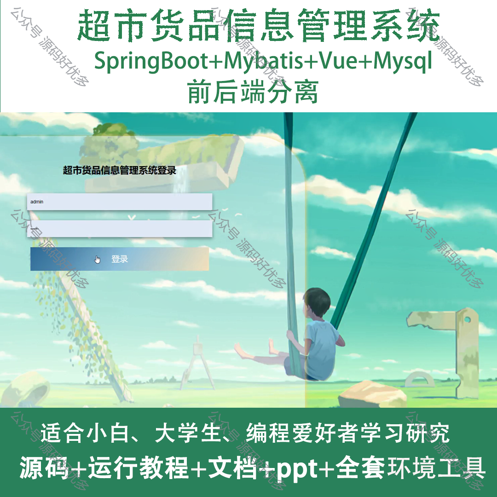
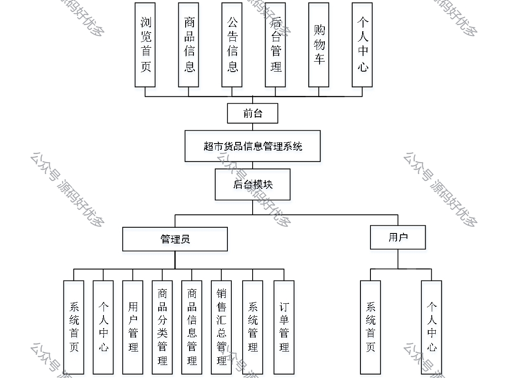
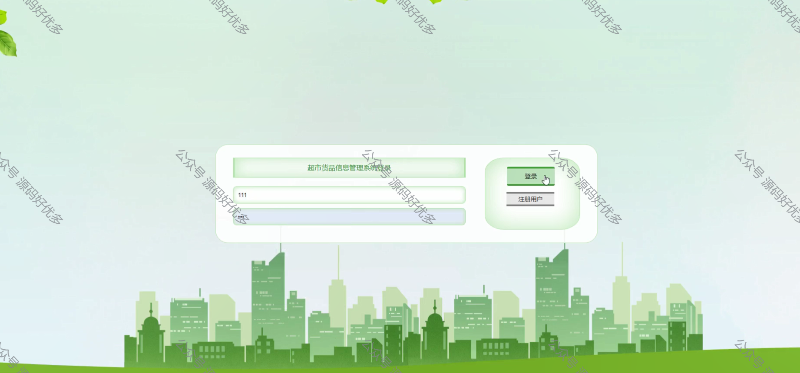
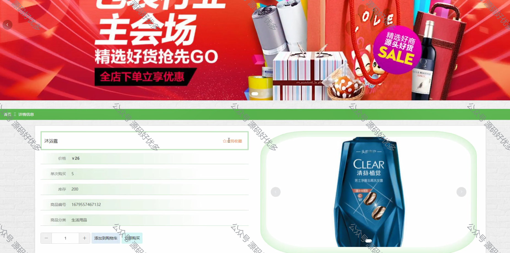
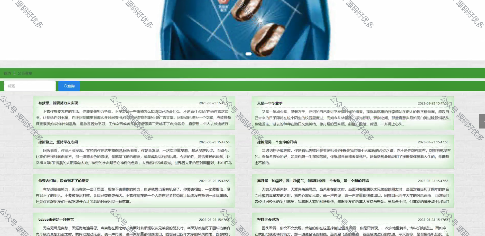
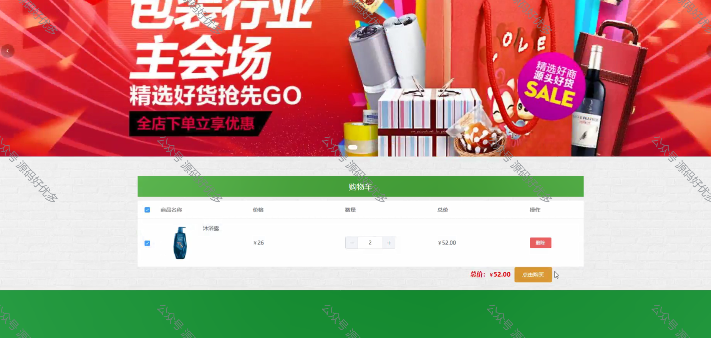
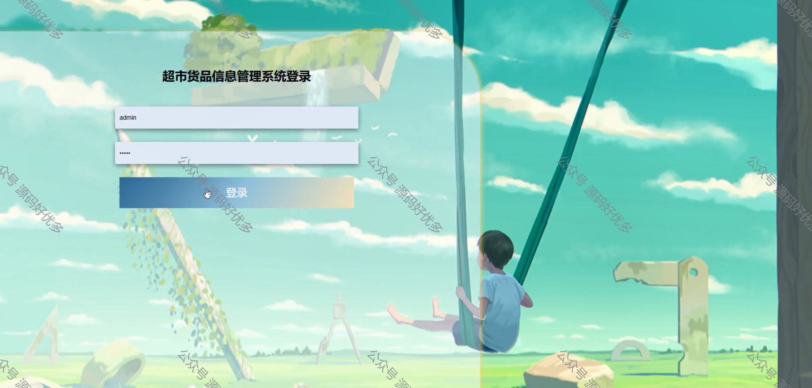
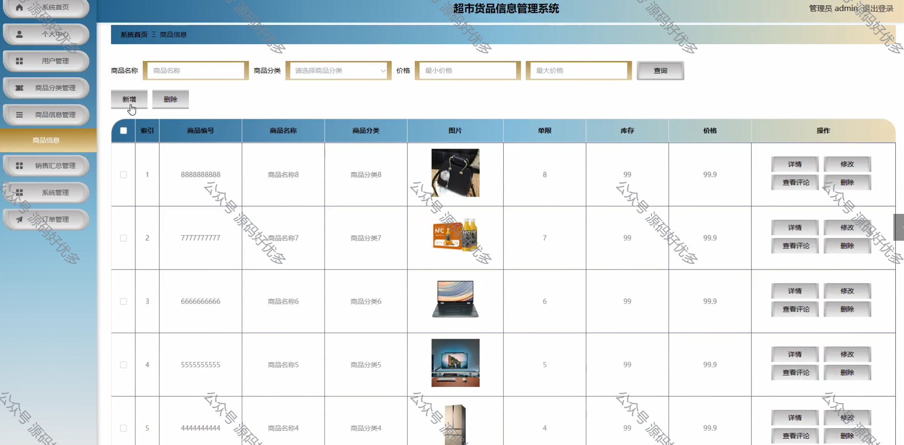
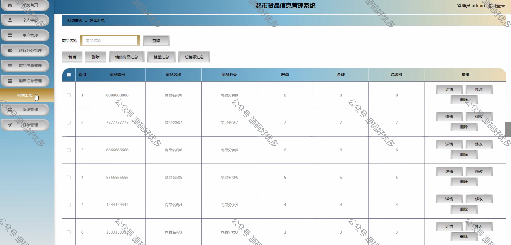
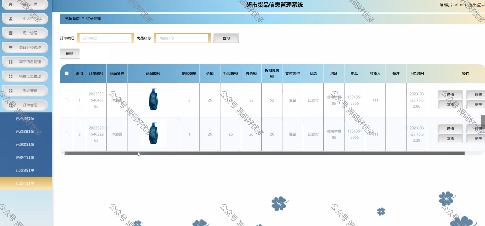
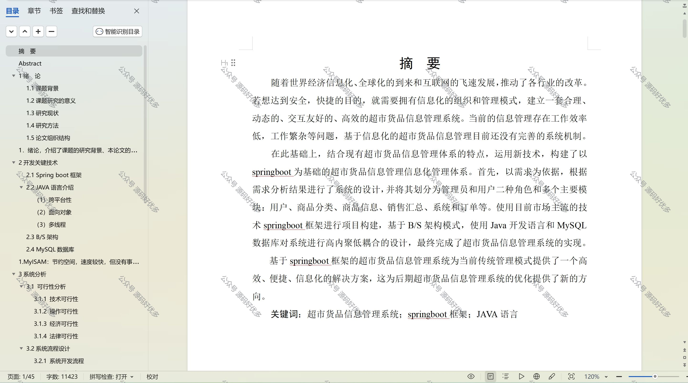

  
